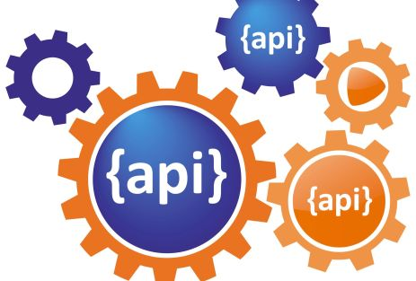

# Introduction

Zalando’s software architecture centers around decoupled microservices that provide functionality
via RESTful APIs with a JSON payload. Small engineering teams own, deploy and operate these microservices in
their AWS (team) accounts. Our APIs most purely express what our systems do, and are therefore
highly valuable business assets. Designing high-quality, long-lasting APIs has become even more
critical for us since we started developing our new open platform strategy, which transforms Zalando
from an online shop into an expansive fashion platform. Our strategy emphasizes developing lots of
public APIs for our external business partners to use via third-party applications.

With this in mind, we’ve adopted “API First” as one of our key engineering principles.
Microservices development begins with API definition outside the code and ideally involves ample
peer-review feedback to achieve high-quality APIs. API First encompasses a set of quality-related
standards and fosters a peer review culture including a lightweight review procedure.
We encourage our teams to follow them to ensure that our APIs:

- are easy to understand and learn
- are general and abstracted from specific implementation and use cases
- are robust and easy to use
- have a common look and feel
- follow a consistent RESTful style and syntax
- are consistent with other teams’ APIs and our global architecture

Ideally, all Zalando APIs will look like the same author created them.

## Zalando specific information

The purpose of our “RESTful API guidelines” is to define standards to successfully establish
“consistent API look and feel” quality. The [API Guild \[internal link\]](https://techwiki.zalando.net/display/GUL/API+Guild) drafted and owns this document. Teams are responsible to fulfill these guidelines during API
development and are encouraged to contribute to guideline evolution via pull requests.

Note: These guidelines will, to some extent, remain work in progress as our work evolves, but
teams can confidently follow and trust them.
