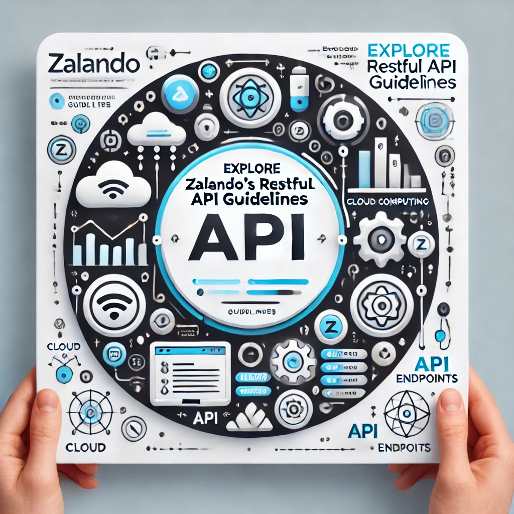

:stylesheet: zalando.css
:source-highlighter: coderay
:toc: macro
:toclevels: 2
:leveloffset: +1
:sectlinks:
:sectnumlevels: 1

:creator: Zalando SE
:producer: Asciidoctor
:keywords: Zalando, Guidelines, RESTful, API, Events, Schema
:copyright: CC-BY-SA 3.0

:MUST: pass:[<strong>Must</strong>:]
:SHOULD: pass:[<strong>Should</strong>:]
:MAY: pass:[<strong>May</strong>:]
:MUST-SHOULD: pass:[<strong>Must</strong>/<strong>Should</strong>:]

= Zalando RESTful API and Event Scheme Guidelines
Zalando SE

Other formats: link:zalando-guidelines.pdf[PDF], link:zalando-guidelines.epub[EPUB3]

toc::[]

:sectnums:

include::chapters/introduction.adoc[]
include::chapters/design-principles.adoc[]
include::chapters/general-guidelines.adoc[]
include::chapters/meta-information.adoc[]
include::chapters/security.adoc[]
include::chapters/compatibility.adoc[]
include::chapters/deprecation.adoc[]
include::chapters/json-guidelines.adoc[]
include::chapters/naming.adoc[]
include::chapters/resources.adoc[]
include::chapters/http.adoc[]
include::chapters/performance.adoc[]
include::chapters/pagination.adoc[]
include::chapters/hyper-media.adoc[]
include::chapters/data-formats.adoc[]
include::chapters/common-data-types.adoc[]
include::chapters/common-headers.adoc[]
include::chapters/proprietary-headers.adoc[]
include::chapters/api-operation.adoc[]
include::chapters/events.adoc[]
include::chapters/references.adoc[]
include::chapters/tooling.adoc[]
include::chapters/best-practices.adoc[]
include::chapters/changelog.adoc[]

++++
<!-- Adds rule id as a postfix to all rule titles -->

<!-- Add table of contents anchor and remove document title -->

<!-- Adds sidebar navigation -->

++++

++++